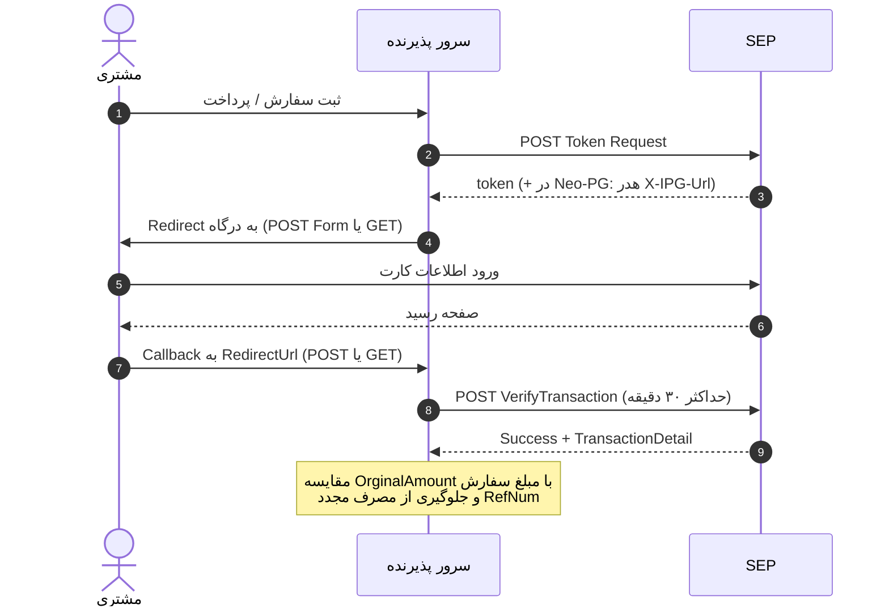

# راهنمای پیاده‌سازی درگاه پرداخت اینترنتی بانک سامان (SEP)

> **منبع:** مستند فنی SEP OnlinePG نگارش **۳.۶** (دی ۱۴۰۴) + راهنمای Neo-PG/بلوپی + FAQ پذیرندگان  
> **هدف:** فقط موارد لازم برای توسعه و یکپارچه‌سازی API

---

## فهرست

1. [جریان تراکنش](#۱-جریان-تراکنش)
2. [پیش‌نیازها و آدرس‌ها](#۲-پیشنیازها-و-آدرسها)
3. [دریافت توکن](#۳-دریافت-توکن)
4. [هدایت به درگاه](#۴-هدایت-به-درگاه)
5. [Callback](#۵-callback)
6. [Verify (الزامی)](#۶-verify-الزامی)
7. [Reverse (اختیاری)](#۷-reverse-اختیاری)
8. [کدهای وضعیت و خطا](#۸-کدهای-وضعیت-و-خطا)
9. [Neo-PG / بلوپی](#۹-neo-pg--بلوپی)
10. [نکات حیاتی پیاده‌سازی](#۱۰-نکات-حیاتی-پیادهسازی)

---

## ۱. جریان تراکنش



---

## ۲. پیش‌نیازها و آدرس‌ها

### پیش‌نیازها
| مورد | توضیح |
| :--- | :--- |
| IP سرور | IP سرور پذیرنده باید در SEP ثبت شده باشد (برای Token و Verify/Reverse) |
| TerminalId | فقط از **شماره ترمینال** استفاده کنید؛ نه Merchant ID (MID) |
| HTTPS | ارتباط با SEP روی HTTPS |
| سرور ایران | IP خارج از ایران برای اتصال به درگاه مجاز نیست |
| حداقل مبلغ | طبق FAQ: تراکنش کمتر از **۲۰۰۰ ریال** مجاز نیست |

### Base URLs
| سرویس | آدرس |
| :--- | :--- |
| Token | `POST https://sep.shaparak.ir/onlinepg/onlinepg` |
| Redirect (POST) | `https://sep.shaparak.ir/OnlinePG/OnlinePG` |
| Redirect (GET) | `https://sep.shaparak.ir/OnlinePG/SendToken?token=...` |
| Verify | `POST https://sep.shaparak.ir/verifyTxnRandomSessionkey/ipg/VerifyTransaction` |
| Reverse | `POST https://sep.shaparak.ir/verifyTxnRandomSessionkey/ipg/ReverseTransaction` |
| پنل گزارش | `https://report.sep.ir` |
| IP درگاه (دیباگ شبکه) | `91.240.182.20:443` |

---

## ۳. دریافت توکن

* **Method:** `POST`
* **Header:** `Content-Type: application/json`

### Request Body

| پارامتر | نوع | الزامی | توضیحات |
| :--- | :--- | :---: | :--- |
| `action` | String | بله | مقدار `"token"` (طبق مستند به حروف حساس نیست) |
| `TerminalId` | String | بله | شماره ترمینال |
| `Amount` | Integer | بله | مبلغ به ریال؛ عدد صحیح بدون اعشار/جداکننده |
| `ResNum` | String | بله | شماره سفارش یکتا سمت پذیرنده |
| `RedirectUrl` | String | بله | آدرس بازگشت؛ حداکثر **۲۰۸۳** کاراکتر (با `GetMethod=true` حداکثر **۱۵۳۸**) |
| `CellNumber` | String | خیر | موبایل خریدار برای بازیابی کارت‌های ذخیره‌شده |
| `TokenExpiryInMin` | Integer | خیر | اعتبار توکن به دقیقه؛ بازه ۲۰–۳۶۰۰؛ پیش‌فرض ۲۰ |
| `Wage` | Integer | خیر | کارمزد تسهیم؛ مبلغ کسرشده = `Amount + Wage` |
| `AffectiveAmount` | Integer | خیر | مبلغ کسر از کارت (سامانه تخفیف) |
| `HashedCardNumber` | String | خیر | MD5 شماره کارت(ها)؛ حداکثر ۱۰ کارت با جداکننده `\|` یا `;` یا `,` |
| `ResNum1`…`ResNum4` | String | خیر | دیتای گزارش‌گیری پنل؛ حداکثر ۵۰ کاراکتر |

```json
{
  "action": "token",
  "TerminalId": "0000",
  "Amount": 12000,
  "ResNum": "ORDER_1002498",
  "RedirectUrl": "https://mysite.com/payment/callback",
  "CellNumber": "9120000000"
}
```

### Response

| فیلد | توضیح |
| :--- | :--- |
| `status` | `1` موفق، `-1` خطا |
| `token` | توکن پرداخت (در صورت موفقیت) |
| `errorCode` | کد خطا (وقتی `status = -1`) |
| `errorDesc` | شرح خطا |

```json
{ "status": 1, "token": "2c3c1fefac5a48geb9f9be7e445dd9b2" }
```

```json
{
  "status": -1,
  "errorCode": "5",
  "errorDesc": "پارامترهای ارسال شده نامعتبر است.; شماره تراکنش پذیرنده الزامی است"
}
```

> کد خطای IP نامعتبر در دریافت توکن: **۸** (FAQ). در Verify معمولاً **-۱۰۶** یا طبق FAQ **-۱۸**.

---

## ۴. هدایت به درگاه

هدایت باید از دامنه ثبت‌شده پذیرنده انجام شود تا `Referrer` معتبر باشد؛ در غیر این صورت خطای «آدرس ارجاع‌دهنده معتبر نیست».

### روش ۱ — POST Form (توصیه‌شده)

```html
<form id="sepForm" action="https://sep.shaparak.ir/OnlinePG/OnlinePG" method="post">
  <input type="hidden" name="Token" value="TOKEN_HERE" />
  <!-- true = بازگشت Callback با GET؛ خالی/false = POST -->
  <input type="hidden" name="GetMethod" value="" />
</form>
<script>document.getElementById('sepForm').submit();</script>
```

### روش ۲ — GET Redirect

```
https://sep.shaparak.ir/OnlinePG/SendToken?token=TOKEN_HERE
```

در این حالت `GetMethod` قابل ارسال نیست؛ Callback همیشه POST است.

### روش ۳ — Neo-PG

آدرس را از هدر `X-IPG-Url` پاسخ توکن بخوانید (ثابت هاردکد نکنید).

---

## ۵. Callback

پس از پرداخت، کاربر به `RedirectUrl` برمی‌گردد (پیش‌فرض POST؛ با `GetMethod=true` به‌صورت GET/QueryString).

| پارامتر | توضیح |
| :--- | :--- |
| `MID` / `TerminalId` | شماره ترمینال |
| `State` | وضعیت متنی (مثل `OK`, `CanceledByUser`) |
| `Status` | وضعیت عددی (`2` = موفق) |
| `ResNum` | شماره سفارش پذیرنده |
| `RefNum` | رسید دیجیتالی یکتا؛ خالی = تراکنش ناموفق |
| `RRN` | شماره مرجع شتاب |
| `TraceNo` | شماره رهگیری SEP |
| `Amount` | مبلغ به ریال |
| `Wage` | کارمزد (در صورت وجود) |
| `AffectiveAmount` | مبلغ واقعی کسرشده (تخفیف) |
| `SecurePan` | کارت ماسک‌شده |
| `HashedCardNumber` | هش **SHA256** کارت |

شرط ورود به Verify: `State == "OK"` (یا `Status == 2`) و `RefNum` غیرخالی.

---

## ۶. Verify (الزامی)

حداکثر **۳۰ دقیقه** پس از تراکنش. در غیر این صورت تراکنش خودکار Reverse می‌شود.

* **URL:** `POST https://sep.shaparak.ir/verifyTxnRandomSessionkey/ipg/VerifyTransaction`
* **Header:** `Content-Type: application/json`

```json
{
  "RefNum": "jJnBmy/IojtTemplUH5ke9ULCGtDtb",
  "TerminalNumber": 2015
}
```

> نام فیلد ترمینال در Verify/Reverse: **`TerminalNumber`** (نه `TerminalId`).

### Response

| فیلد | توضیح |
| :--- | :--- |
| `Success` | موفقیت کل درخواست |
| `ResultCode` | `0` = موفق |
| `ResultDescription` | شرح فارسی |
| `TransactionDetail` | جزئیات تراکنش |

#### `TransactionDetail` — املای دقیق کلیدها (ثابت در API)

| کلید JSON | توضیح |
| :--- | :--- |
| `RRN` | شماره مرجع |
| `RefNum` | رسید دیجیتالی |
| `MaskedPan` | کارت ماسک‌شده |
| `HashedPan` | هش کارت |
| `TerminalNumber` | ترمینال |
| `OrginalAmount` | مبلغ ارسالی به درگاه (**بدون i بعد از g**) |
| `AffectiveAmount` | مبلغ کسرشده واقعی |
| `StraceDate` | تاریخ/زمان (**با S اول**) |
| `StraceNo` | رهگیری (**با S اول**) |

```json
{
  "TransactionDetail": {
    "RRN": "14226761817",
    "RefNum": "50",
    "MaskedPan": "621986****8080",
    "HashedPan": "b96a14400c3a59249e87c300ecc06e5920327e70220213b5bbb7d7b2410f7e0d",
    "TerminalNumber": 2001,
    "OrginalAmount": 1000,
    "AffectiveAmount": 1000,
    "StraceDate": "2019-09-16 18:11:06",
    "StraceNo": "100428"
  },
  "ResultCode": 0,
  "ResultDescription": "عملیات با موفقیت انجام شد",
  "Success": true
}
```

قبل از تحویل کالا:
1. `RefNum` را در DB چک کنید (ضد Double Spending — SEP خودش مصرف مجدد را رد نمی‌کند).
2. `OrginalAmount` (یا `AffectiveAmount` در تخفیف) را با مبلغ سفارش مقایسه کنید.

---

## ۷. Reverse (اختیاری)

تا حداکثر **۵۰ دقیقه** پس از تراکنش، برای برگشت وجه پس از Verify موفق.

* **URL:** `POST https://sep.shaparak.ir/verifyTxnRandomSessionkey/ipg/ReverseTransaction`
* Body و Response مشابه Verify (`RefNum` + `TerminalNumber`).

---

## ۸. کدهای وضعیت و خطا

### Callback — `Status` / `State`

| Status | State | معنی |
| :---: | :--- | :--- |
| 1 | `CanceledByUser` | انصراف کاربر |
| 2 | `OK` | پرداخت موفق |
| 3 | `Failed` | پرداخت ناموفق |
| 4 | `SessionIsNull` | انقضای نشست / Refresh صفحه Callback |
| 5 | `InvalidParameters` | پارامتر نامعتبر |
| 8 | `MerchantIpAddressIsInvalid` | IP پذیرنده نامعتبر (توکن) |
| 10 | `TokenNotFound` | توکن یافت نشد |
| 11 | `TokenRequired` | فقط تراکنش توکنی مجاز است |
| 12 | `TerminalNotFound` | ترمینال یافت نشد/غیرفعال |
| 21 | `MultisettlePolicyErrors` | خطای محدودیت چندحسابی |

### Verify / Reverse — `ResultCode`

| کد | API | معنی |
| :---: | :--- | :--- |
| 0 | verify \| reverse | موفق |
| 2 | verify \| reverse | درخواست تکراری (قبلاً تایید/برگشت شده) |
| -2 | verify | تراکنش یافت نشد |
| -6 | verify | بیش از ۳۰ دقیقه گذشته / منقضی |
| -104 | verify \| reverse | ترمینال غیرفعال |
| -105 | verify \| reverse | ترمینال موجود نیست |
| -106 | verify \| reverse | IP غیرمجاز |
| 5 | verify | تراکنش قبلاً برگشت خورده |

### خطاهای رایج FAQ (توسعه)

| خطا | علت عملیاتی |
| :--- | :--- |
| `-33` ترمینال به این نسخه دسترسی ندارد | پیاده‌سازی باید `onlinepg` باشد؛ ترمینال LightIPG/MobilePG نباشد |
| آدرس ارجاع‌دهنده معتبر نیست | دامنه/`www`/https با دامنه ثبت‌شده SEP یکی نیست |
| کد پذیرنده نامعتبر است | استفاده از MID به‌جای TerminalId |
| `03` هنگام تراکنش | ترمینال غیرفعال (نماد/مالیات/…) یا شبا تسهیم اشتباه؛ `IR` باید حروف بزرگ باشد |
| `-111` در Verify | ساختار درخواست Verify اشتباه (جابجایی/خالی بودن `RefNum` یا `TerminalNumber`) |
| امکان تایید تراکنش وجود ندارد / `-6` | Verify بعد از ۳۰ دقیقه |
| Session Is Null | Refresh صفحه Callback یا تغییر شبکه کاربر وسط پرداخت |
| 504 / Timeout اتصال | پورت ۴۴۳، مسیر به `91.240.182.20`، سرور خارج ایران |

---

## ۹. Neo-PG / بلوپی

1. فعال‌سازی ترمینال با واحد کسب‌وکار نوین SEP.
2. فیلدهای Token/Callback/Verify **بدون تغییر** نسبت به IPG عادی.
3. تنها تفاوت: در پاسخ Token هدر `X-IPG-Url` را بخوانید و فرم را به همان آدرس POST کنید.

```http
HTTP/1.1 200 OK
Content-Type: application/json; charset=utf-8
X-IPG-Url: https://neo-pg.sep.ir/transaction/init

{"status":1,"token":"496a7e405c47406dab0d8b5e3d9c85ec"}
```

```html
<form action="URL_FROM_X-IPG-Url" method="post">
  <input type="hidden" name="Token" value="TOKEN_HERE" />
</form>
```

---

## ۱۰. نکات حیاتی پیاده‌سازی

1. **Double Spending:** SEP با Verify تکراری روی همان `RefNum` ممکن است دوباره موفق برگرداند؛ یکتایی را در DB خودتان enforce کنید.
2. **مبلغ:** همیشه `OrginalAmount` را با سفارش مقایسه کنید؛ به `Success` به‌تنهایی اعتماد نکنید.
3. **Retry روی Timeout:** اگر پاسخ Verify نرسید، Retry کنید؛ فقط با کد خطای صریح منفی تراکنش را ناموفق بدانید.
4. **هش کارت:** ورودی توکن = **MD5**؛ خروجی Callback = **SHA256**. شماره کارت خام ذخیره نشود.
5. **Referrer:** Redirect فقط از فرم/لینک دامنه ثبت‌شده.
6. **تسهیم:** شبا باید دقیقاً شبا تاییدشده ترمینال باشد و با `IR` حروف بزرگ شروع شود.
