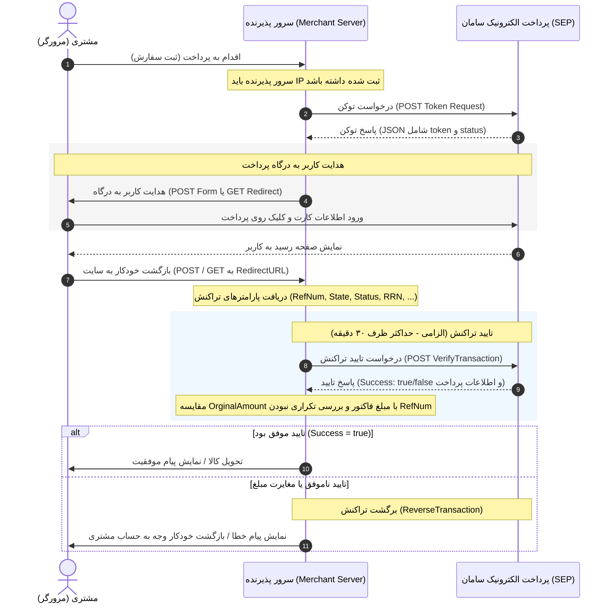

# راهنمای فنی و مستند پیاده‌سازی درگاه پرداخت اینترنتی بانک سامان (SEP)
> **نسخه مستند:** ۳.۶ (آخرین به‌روزرسانی: دی ۱۴۰۴)  
> **فرمت سند:** مناسب برای توسعه‌دهندگان (Developer-Friendly) و خوانش ماشین/عوامل هوشمند (AI Agents)

---

## فهرست مطالب
1. [دیاگرام جریان تراکنش (Sequence Diagram)](#۱-دیاگرام-جریان-تراکنش-sequence-diagram)
2. [نیازمندی‌های امنیتی و آدرس‌های سرور](#۲-نیازمندیهای-امنیتی-و-آدرسهای-سرور)
3. [مرحله اول: دریافت توکن پرداخت (Token Request)](#۳-مرحله-اول-دریافت-توکن-پرداخت-token-request)
4. [مرحله دوم: هدایت کاربر به صفحه پرداخت (Redirect to IPG)](#۴-مرحله-دوم-هدایت-کاربر-به-صفحه-پرداخت-redirect-to-ipg)
5. [مرحله سوم: بازگشت به سایت پذیرنده (Callback Response)](#۵-مرحله-سوم-بازگشت-به-سایت-پذیرنده-callback-response)
6. [مرحله چهارم: تایید تراکنش (Verify Transaction) - الزامی](#۶-مرحله-چهارم-تایید-تراکنش-verify-transaction---الزامی)
7. [مرحله پنجم: برگشت تراکنش (Reverse Transaction) - اختیاری](#۷-مرحله-پنجم-برگشت-تراکنش-reverse-transaction---اختیاری)
8. [جدول کدهای خطا و وضعیت‌ها (Error & Status Codes)](#۸-جدول-کدهای-خطا-و-وضعیتها-error--status-codes)
9. [نکات بسیار مهم امنیتی و فنی (Gotchas & Best Practices)](#۹-نکات-بسیار-مهم-امنیتی-و-فنی-gotchas--best-practices)

---

## ۱. دیاگرام جریان تراکنش (Sequence Diagram)

جریان تبادل اطلاعات بین مرورگر مشتری، سرور پذیرنده و سرور پرداخت الکترونیک سامان (SEP) به شرح زیر است:



---

## ۲. نیازمندی‌های امنیتی و آدرس‌های سرور

### الف) نیازمندی‌های امنیتی
1. **ثبت IP سرور پذیرنده:** آی‌پی سرور پذیرنده (Merchant IP) باید قبل از شروع تراکنش در سیستم شرکت SEP ثبت شده باشد. در غیر این صورت، درخواست دریافت توکن یا تایید تراکنش با خطا مواجه خواهد شد.
2. **پروتکل SSL:** ارتباط پذیرنده با درگاه باید روی بستر امن HTTPS برقرار باشد.
3. **رمزنگاری شماره کارت:** برای محدود کردن پرداخت به کارت‌های خاص، پذیرنده باید هش MD5 شماره کارت‌ها را ارسال کند. شماره کارت واقعی خریدار هرگز نباید در سرور پذیرنده ذخیره شود.

### ب) آدرس‌های سرور (Base URLs)
* **وب‌سرویس دریافت توکن و درگاه پرداخت:**
  `https://sep.shaparak.ir`
* **وب‌سرویس تایید (Verify) و برگشت (Reverse) تراکنش:**
  `https://sep.shaparak.ir/verifyTxnRandomSessionkey/ipg`
* **سامانه گزارش‌گیری آنلاین پذیرندگان:**
  `https://report.sep.ir`

---

## ۳. مرحله اول: دریافت توکن پرداخت (Token Request)

برای شروع فرآیند پرداخت، ابتدا باید یک درخواست سمت سرور (Server-to-Server) به صورت **POST** و با فرمت **JSON** ارسال نمایید.

* **آدرس وب‌سرویس:** `https://sep.shaparak.ir/onlinepg/onlinepg`
* **هدر درخواست:** `Content-Type: application/json`

### پارامترهای ارسالی (Request JSON Body)

| نام پارامتر | نوع داده | اجباری/اختیاری | توضیحات |
| :--- | :--- | :---: | :--- |
| `action` | String | **اجباری** | باید مقدار آن دقیقاً `"token"` باشد (حساس به حروف کوچک). |
| `TerminalId` | String | **اجباری** | شماره ترمینال دریافتی از شرکت SEP. |
| `Amount` | Integer | **اجباری** | مبلغ خرید به ریال (باید عدد صحیح بدون اعشار و کاراکتر اضافی باشد). |
| `ResNum` | String | **اجباری** | شماره خرید/سفارش یکتا تولید شده توسط پذیرنده (تا از تکرار پرداخت جلوگیری شود). |
| `RedirectUrl` | String | **اجباری** | آدرس صفحه‌ای از سایت پذیرنده که خریدار پس از پرداخت به آن هدایت می‌شود (حداکثر ۲۰۸۳ کاراکتر). |
| `CellNumber` | String | اختیاری | شماره موبایل خریدار جهت بازیابی اطلاعات کارت‌های قبلی ذخیره شده او. |
| `TokenExpiryInMin` | Integer | اختیاری | مدت زمان اعتبار توکن برحسب دقیقه (کمینه ۲۰ و بیشینه ۳۶۰۰ دقیقه. پیش‌فرض: ۲۰ دقیقه). |
| `Wage` | Integer | اختیاری | کارمزد کسر شده از تراکنش (ویژه پذیرندگانی که از تسهیم استفاده می‌کنند). |
| `AffectiveAmount` | Integer | اختیاری | مبلغ کسر شده نهایی از کارت خریدار (ویژه سامانه تخفیف پذیرنده). |
| `HashedCardNumber` | String | اختیاری | شماره کارت هش شده با MD5 جهت الزام کاربر به پرداخت با کارتی مشخص (حداکثر ۱۰ کارت با جداکننده `\|` یا `;` یا `,`). |

#### نمونه درخواست (JSON Request)
```json
{
  "action": "token",
  "TerminalId": "99999999",
  "Amount": 12000,
  "ResNum": "ORDER_1002498",
  "RedirectUrl": "https://mysite.com/payment/callback",
  "CellNumber": "09120000000"
}
```

### پارامترهای دریافتی در پاسخ (Response JSON Body)

| نام پارامتر | نوع داده | توضیحات |
| :--- | :--- | :--- |
| `status` | Integer | وضعیت درخواست؛ عدد `1` به معنی موفق و `1-` به معنی بروز خطا است. |
| `token` | String | توکن یکتای تراکنش (در صورت موفقیت تراکنش صادر می‌شود و تا زمان انقضا معتبر است). |
| `errorCode` | String | کد خطا (در صورت بروز خطا، از کدهای خطای بخش ۸ قرار می‌گیرد). |
| `errorDesc` | String | شرح خطا به زبان فارسی. |

#### نمونه پاسخ موفق (Successful Response)
```json
{
  "status": 1,
  "token": "2c3c1fefac5a48geb9f9be7e445dd9b2"
}
```

#### نمونه پاسخ خطا (Error Response)
```json
{
  "status": -1,
  "errorCode": "5",
  "errorDesc": "پارامترهای ارسال شده نامعتبر است.; شماره تراکنش پذیرنده الزامی است"
}
```

---

### دریافت توکن در درگاه جدید Neo-PG / بلوپی (Blu Pay)
نسخه جدید درگاه پرداخت سامان تحت عنوان **Neo-PG** (که برای سرویس‌هایی مثل بلوپی/Blu Pay استفاده می‌شود) تغییرات کوچکی در نحوه دریافت توکن و هدایت کاربر دارد:
* **پیش‌نیاز:** هماهنگی با **واحد کسب و کار نوین پرداخت الکترونیک سامان** جهت فعال‌سازی Neo-PG روی ترمینال.
* **تغییر آدرس هدایت (مهم):** در پاسخ وب‌سرویس دریافت توکن Neo-PG، یک هدر HTTP سفارشی به نام **`X-IPG-Url`** برگشت داده می‌شود (به عنوان مثال `X-IPG-Url: https://neo-pg.sep.ir/transaction/init`). پذیرنده باید آدرس درگاه را پویا از این فیلد هدر بخواند و کاربر را به آن آدرس هدایت کند (به جای هاردکد کردن آدرس درگاه سنتی).

#### نمونه پاسخ Neo-PG:
```http
HTTP/1.1 200 OK
X-IPG-Url: https://neo-pg.sep.ir/transaction/init

{"status":1,"token":"496a7e405c47406dab0d8b5e3d9c85ec"}
```

> [!WARNING]
> **خطای ۳۳ (ترمینال به این نسخه از درگاه دسترسی ندارد):** این خطا زمانی رخ می‌دهد که پیاده‌سازی پذیرنده با نسخه درگاه تنظیم‌شده برای ترمینال در سیستم سپ مطابقت نداشته باشد (مثلاً ترمینال LightIPG/MobilePG باشد اما از درگاه onlinepg درخواست توکن شود).

---

## ۴. مرحله دوم: هدایت کاربر به صفحه پرداخت (Redirect to IPG)

پس از دریافت توکن معتبر، باید کاربر را با یکی از دو روش زیر به درگاه پرداخت بانک سامان هدایت کنید:

### روش اول: هدایت از طریق فرم HTML و متد POST (توصیه شده)
در این روش می‌توانید پارامتر اختیاری `GetMethod` را ارسال کنید تا پاسخ برگشت به سایت شما (Callback) با متد GET صورت پذیرد.

```html
<form id="sep-payment-form" action="https://sep.shaparak.ir/OnlinePG/OnlinePG" method="post">
  <!-- توکن دریافت شده از مرحله قبل -->
  <input type="hidden" name="Token" value="2c3c1fefac5a48geb9f9be7e445dd9b2" />
  
  <!-- مقادیر مجاز: true (برای بازگشت با GET) | false یا مقدار خالی (برای بازگشت پیش‌فرض با POST) -->
  <input type="hidden" name="GetMethod" value="true" />
</form>

<script>
  // ارسال خودکار فرم
  document.getElementById('sep-payment-form').submit();
</script>
```

### روش دوم: هدایت مستقیم از طریق Redirect و متد GET
کاربر را مستقیماً به آدرس زیر ریدایرکت کنید (در این روش امکان تغییر متد پاسخ به GET وجود ندارد و پاسخ حتماً POST خواهد بود):

```
https://sep.shaparak.ir/OnlinePG/SendToken?token=2c3c1fefac5a48geb9f9be7e445dd9b2
```

### روش سوم: هدایت در درگاه Neo-PG / بلوپی (Blu Pay)
در صورت استفاده از درگاه جدید Neo-PG، آدرس اتصال به درگاه پرداخت برای پذیرنده ثابت نبوده و باید مستقیماً از هدر پاسخ دریافت توکن (`X-IPG-Url`) دریافت شود. به عنوان مثال فرم هدایت به صورت زیر خواهد بود:
```html
<form id="sepForm" action="[آدرس دریافت شده از هدر X-IPG-Url]" method="post">
  <input type="hidden" name="Token" value="[توکن دریافت شده]" />
</form>
```

> [!WARNING]
> **۱. الزام وجود Referrer و تطابق دامین:** هدایت کاربر از طریق هر کدام از روش‌های فوق، حتماً بایستی از طریق سابمیت فرم یا لینک کلیک شده توسط کاربر در سایت پذیرنده انجام شود تا هدر `Referrer` مرورگر فرستاده شود. همچنین دامنه ارجاع‌دهنده (Referrer) باید کاملاً با دامنه ثبت شده در سپ همخوانی داشته باشد؛ در غیر این صورت با خطای **«آدرس ارجاع دهنده معتبر نیست»** مواجه خواهید شد. مواردی مانند عدم همخوانی ساب‌دامین‌ها یا تفاوت در استفاده از پروتکل (مانند `https://www` در برابر نسخه بدون www) باعث بروز این خطا می‌شود.
> 
> **۲. خطای «کد پذیرنده نامعتبر است» (MID vs TerminalId):** در تمامی مراحل پیاده‌سازی و کدنویسی درگاه، فقط و فقط باید از **شماره ترمینال (Terminal ID)** استفاده کنید. استفاده اشتباه از شماره پذیرنده (Merchant ID یا MID) به جای شماره ترمینال منجر به خطای نامعتبر بودن کد پذیرنده می‌شود.

---

## ۵. مرحله سوم: بازگشت به سایت پذیرنده (Callback Response)

پس از پایان پرداخت در درگاه، کاربر به همراه پارامترهای زیر به `RedirectUrl` ثبت‌شده هدایت می‌شود. این داده‌ها به صورت پیش‌فرض با متد **POST** ارسال می‌گردند (مگر اینکه در مرحله قبل `GetMethod` را برابر `true` گذاشته باشید که با متد **GET** و به صورت QueryString ارسال خواهد شد).

### پارامترهای دریافتی در Callback

| نام پارامتر | نوع داده | توضیحات |
| :--- | :--- | :--- |
| `MID` / `TerminalId` | String | شماره ترمینال پذیرنده. |
| `State` | String | وضعیت تراکنش به صورت متنی انگلیسی (مانند `"OK"` یا `"CanceledByUser"`). |
| `Status` | Integer | وضعیت تراکنش به صورت عددی (مانند `2` برای موفق). |
| `ResNum` | String | شماره خرید/سفارش ارسال شده در درخواست اولیه پذیرنده. |
| `RefNum` | String | **رسید دیجیتالی تراکنش (یکتا در کل سیستم). در صورت خالی بودن، تراکنش با خطا مواجه شده است.** |
| `RRN` | String | شماره مرجع بانک (Retrieve Reference Number). |
| `TraceNo` | String | شماره رهگیری تراکنش صادر شده توسط سیستم درگاه. |
| `Amount` | Integer | مبلغ تراکنش به ریال. |
| `Wage` | Integer | مبلغ کارمزد تراکنش (در صورت وجود). |
| `AffectiveAmount` | Integer | مبلغ کسر شده نهایی از کارت خریدار. |
| `SecurePan` | String | شماره کارت خریدار به صورت ماسک شده (مثال: `621986****8080`). |
| `HashedCardNumber` | String | هش **SHA256** شماره کارت خریدار. |

> [!IMPORTANT]
> **بررسی اولیه صحت پرداخت:** پذیرنده باید ابتدا فیلد `State` را بررسی کند. در صورتی که مقدار آن برابر `"OK"` (یا `Status` برابر `2`) و مقدار `RefNum` غیرتهی باشد، تراکنش در درگاه موفق بوده و باید فوراً برای تایید نهایی وب‌سرویس VerifyTransaction را صدا بزند.

---

## ۶. مرحله چهارم: تایید تراکنش (Verify Transaction) - الزامی

> [!IMPORTANT]
> **محدودیت زمانی ۳۰ دقیقه:** پس از بازگشت کاربر، پذیرنده حداکثر **۳۰ دقیقه** فرصت دارد تا متد تایید تراکنش (`VerifyTransaction`) را فراخوانی کند. در غیر این صورت، تراکنش به صورت خودکار برگشت خورده (Reverse) و پول به حساب مشتری واریز می‌شود.

* **آدرس وب‌سرویس:** `https://sep.shaparak.ir/verifyTxnRandomSessionkey/ipg/VerifyTransaction`
* **هدر درخواست:** `Content-Type: application/json`

### پارامترهای ارسالی (Verify Request Body)

| نام پارامتر | نوع داده | توضیحات |
| :--- | :--- | :--- |
| `RefNum` | String | رسید دیجیتالی دریافتی در Callback (فیلد `RefNum`). |
| `TerminalNumber` | Integer / Long | شماره ترمینال پذیرنده. **(توجه: نام فیلد در درخواست تایید TerminalNumber است و نه TerminalId)** |

#### نمونه درخواست تایید
```json
{
  "RefNum": "jJnBmy/IojtTemplUH5ke9ULCGtDtb",
  "TerminalNumber": 99999999
}
```

> [!WARNING]
> **خطاهای مهم در پیاده‌سازی تایید تراکنش (Verify Errors):**
> 
> **۱. خطای 03:** در صورتی که ساختار ارسال درخواست تایید اشتباه یا ناقص باشد (مثلاً جابجایی پارامترها، خالی بودن یا اشتباه نوشتن نام فیلدهای `RefNum` یا `TerminalNumber`)، با خطای **`03`** مواجه خواهید شد.
> 
> **۲. خطای ۱۱۱ (منقضی شدن زمان وریفای):** در صورتی که پس از تراکنش موفق توسط کاربر، تابع وریفای ظرف مدت حداکثر ۳۰ دقیقه از سرور پذیرنده ارسال نگردد، تراکنش منقضی شده و درگاه خطای **`111`** (یا پیغام «امکان تایید تراکنش وجود ندارد») برگشت می‌دهد و پول به کارت خریدار بازمی‌گردد.
> 
> **۳. قالب کاراکترهای شبا (تسهیم چند حسابی):** در صورت استفاده از قابلیت تسهیم (چند حسابی)، پارامتر شبای ارسالی باید دقیقاً مطابق با شباهای تایید شده روی ترمینال باشد و عبارت ابتدایی شبا یعنی **`IR`** حتماً باید با **حروف بزرگ انگلیسی** درج گردد (در صورت ارسال با حروف کوچک `ir` تراکنش ناموفق خواهد بود).

---### پارامترهای دریافتی در پاسخ تایید (Verify Response Body)

| نام فیلد | نوع داده | توضیحات |
| :--- | :--- | :--- |
| `Success` | Boolean | وضعیت کل درخواست وب‌سرویس (`true`/`false`). |
| `ResultCode` | Integer | کد پاسخ عملیات تایید (`0` به معنی موفقیت کامل است. کدهای دیگر در بخش ۸). |
| `ResultDescription` | String | شرح وضعیت پاسخ به زبان فارسی. |
| `TransactionDetail` | Object | شیء شامل جزئیات کامل تراکنش تایید شده (توضیحات در زیر). |

#### فیلدهای داخل شیء `TransactionDetail`

> [!CAUTION]
> **غلط املایی در کلیدهای پاسخ درگاه (Typos Warning):**
> فیلدهای دریافتی در وب‌سرویس دارای غلط‌های املایی ثابت هستند. جهت عدم وقوع خطای پارسر در زمان دیسریالایز کردن، از کلیدهای دقیق زیر استفاده کنید:
> * `OrginalAmount` (بدون حرف `i` بعد از `g`)
> * `StraceDate` (دارای حرف `S` در ابتدا)
> * `StraceNo` (دارای حرف `S` در ابتدا)

| نام فیلد در JSON | نوع داده | توضیحات |
| :--- | :--- | :--- |
| `RRN` | String | شماره مرجع تراکنش. |
| `RefNum` | String | رسید دیجیتالی تراکنش. |
| `MaskedPan` | String | شماره کارت خریدار به صورت ماسک شده. |
| `HashedPan` | String | شماره کارت خریدار به صورت هش شده. |
| `TerminalNumber` | Integer | شماره ترمینال پذیرنده. |
| `OrginalAmount` | Long | **مبلغ ارسال شده در درگاه (ریال).** (توجه به املا: `OrginalAmount`) |
| `AffectiveAmount` | Long | مبلغ واقعی کسر شده از حساب خریدار (ریال). |
| `StraceDate` | String | تاریخ و زمان تراکنش. (توجه به املا: `StraceDate`) |
| `StraceNo` | String | شماره رهگیری تراکنش. (توجه به املا: `StraceNo`) |

#### نمونه پاسخ موفق تایید تراکنش (Successful Response)
```json
{
  "TransactionDetail": {
    "RRN": "14226761817",
    "RefNum": "50",
    "MaskedPan": "621986****8080",
    "HashedPan": "b96a14400c3a59249e87c300ecc06e5920327e70220213b5bbb7d7b2410f7e0d",
    "TerminalNumber": 99999999,
    "OrginalAmount": 12000,
    "AffectiveAmount": 12000,
    "StraceDate": "2026-06-29 18:11:06",
    "StraceNo": "100428"
  },
  "ResultCode": 0,
  "ResultDescription": "عملیات با موفقیت انجام شد",
  "Success": true
}
```

---

## ۷. مرحله پنجم: برگشت تراکنش (Reverse Transaction) - اختیاری

در صورتی که پذیرنده بخواهد تراکنش تایید شده را لغو کند و مبلغ را به حساب مشتری برگشت بزند، می‌تواند تا حداکثر **۵۰ دقیقه** پس از انجام تراکنش، سرویس برگشت را فراخوانی کند.

* **آدرس وب‌سرویس:** `https://sep.shaparak.ir/verifyTxnRandomSessionkey/ipg/ReverseTransaction`
* **هدر درخواست:** `Content-Type: application/json`

### پارامترهای ارسالی (Reverse Request Body)
ساختار ارسالی دقیقاً مانند درخواست تایید تراکنش است:
```json
{
  "RefNum": "jJnBmy/IojtTemplUH5ke9ULCGtDtb",
  "TerminalNumber": 99999999
}
```

### پاسخ برگشت تراکنش (Reverse Response Body)
ساختار پاسخ خروجی با وب‌سرویس تایید یکسان است. در صورت موفقیت، مقدار `ResultCode` برابر `0` خواهد بود.

---

## ۸. جدول کدهای خطا و وضعیت‌ها (Error & Status Codes)

### الف) کدهای وضعیت فیلد `Status` و `State` (در پاسخ Callback)

| کد عددی (`Status`) | کد متنی (`State`) | شرح وضعیت / علت خطا |
| :---: | :--- | :--- |
| **2** | `OK` | پرداخت با موفقیت انجام شد. |
| **1** | `CanceledByUser` | خریدار از انجام تراکنش انصراف داده است. |
| **3** | `Failed` | پرداخت در شبکه بانکی انجام نشد. |
| **4** | `SessionIsNull` | خریدار در بازه زمانی تعیین‌شده پاسخی ارسال نکرده و نشست منقضی شده است. |
| **5** | `InvalidParameters` | پارامترهای ارسالی در درخواست توکن نامعتبر است. |
| **8** | `MerchantIpAddressIsInvalid` | آدرس IP سرور پذیرنده نامعتبر است (آی‌پی سرور در سیستم SEP تعریف نشده است). |
| **10** | `TokenNotFound` | توکن پرداخت ارسال شده پیدا نشد. |
| **11** | `TokenRequired` | تراکنش‌ها با این شماره ترمینال فقط به صورت توکنی قابل پرداخت هستند. |
| **12** | `TerminalNotFound` | شماره ترمینال ارسال شده در درگاه وجود ندارد یا غیرفعال است. |
| **21** | `MultisettlePolicyErrors` | محدودیت‌های مربوط به تسویه چند حسابی رعایت نشده است. |

### ب) کدهای نتیجه وب‌سرویس‌های تایید (`Verify`) و برگشت (`Reverse`) در فیلد `ResultCode`

| کد پاسخ | متدهای مرتبط | شرح کد خطا |
| :---: | :---: | :--- |
| **0** | `Verify` \| `Reverse` | **موفقیت کامل عملیات.** |
| **2** | `Verify` \| `Reverse` | درخواست تکراری می‌باشد (این تراکنش قبلاً با موفقیت تایید یا برگشت خورده است). |
| **-2** | `Verify` | تراکنش یافت نشد. |
| **-6** | `Verify` | بیش از نیم ساعت از زمان اجرای تراکنش گذشته و تراکنش منقضی/برگشت خورده است. |
| **-104** | `Verify` \| `Reverse` | ترمینال ارسالی غیرفعال می‌باشد. |
| **-105** | `Verify` \| `Reverse` | شماره ترمینال در سیستم موجود نمی‌باشد. |
| **-106** | `Verify` \| `Reverse` | آی‌پی سرور پذیرنده (فراخوان‌کننده وب‌سرویس) مجاز نمی‌باشد. |
| **5** | `Verify` | تراکنش قبلاً برگشت خورده است. |

---

## ۹. نکات بسیار مهم امنیتی و فنی (Gotchas & Best Practices)

### ۱. مقابله با پرداخت دوبار مصرف (Double Spending)
درگاه پرداخت سامان رسید دیجیتالی (`RefNum`) یکتا صادر می‌کند، اما کنترل عدم مصرف مجدد یک رسید دیجیتالی به عهده سیستم پذیرنده است. 
> [!IMPORTANT]
> در صورتی که یک `RefNum` را چند بار به وب‌سرویس `VerifyTransaction` بفرستید، درگاه هر بار پاسخ موفق (`ResultCode: 0` یا `2`) برگشت می‌دهد. پذیرنده موظف است قبل از تحویل کالا، پایگاه داده خود را بررسی کند تا مطمئن شود سفارش متناظر با این `RefNum` پیش از این تایید و تحویل نشده باشد.

### ۲. بررسی انطباق مبلغ (Amount Validation)
پس از دریافت پاسخ متد `VerifyTransaction` حتماً فیلد `OrginalAmount` (یا `AffectiveAmount` در صورت استفاده از تخفیف) را در آبجکت خروجی با مبلغ سفارش در دیتابیس خود مقایسه کنید. هرگز به صرف موفقیت خروجی متد تایید، کالا را تحویل ندهید؛ احتمال تغییر مبلغ تراکنش در مرورگر توسط کاربر متخلف وجود دارد.

### ۳. مکانیزم تلاش مجدد (Retry Mechanism)
در صورتی که فراخوانی متد `VerifyTransaction` به دلیل خطای شبکه با خطا یا Timeout مواجه شد:
* سفارش را ناموفق تلقی نکنید.
* در یک صف پس‌زمینه (Background Queue)، فرآیند تایید تراکنش را به تعداد دفعات مشخص در بازه ۳۰ دقیقه‌ای تکرار کنید.
* تنها زمانی تراکنش را صد درصد ناموفق اعلام کنید که درگاه کدهای خطای منفی صریح (مانند `2-` یا `6-`) برگرداند.

### ۴. هش شماره کارت (Security whitelisting)
* **ورودی توکن:** پذیرنده در صورت نیاز به محدودسازی تراکنش به کارت‌های خاص، باید هش **MD5** شماره کارت را بفرستد.
* **خروجی تراکنش:** در فیلد `HashedCardNumber` خروجی Callback، درگاه مقدار هش **SHA256** شماره کارت را ارسال می‌کند. این تفاوت در الگوریتم‌ها بسیار حائز اهمیت است.

### ۵. حساسیت به حروف بزرگ و کوچک (Case Sensitivity)
سیستم درگاه پرداخت سامان به حروف بزرگ و کوچک متغیرها حساس است. به عنوان مثال پارامتر `action` باید حتماً حروف کوچک باشد و اسامی فیلدها در وب‌سرویس تایید باید با املا و قالب دقیق نوشته شوند.

### ۶. خطای Session Is Null
این خطا زمانی رخ می‌دهد که کاربر پس از پرداخت، صفحه بازگشت (Callback) را دوباره بارگذاری (Refresh) کند که تراکنش را تکراری و نامعتبر می‌سازد. همچنین تغییر شبکه خریدار (مثلاً سوییچ بین LTE و 3G) در حین تراکنش نیز می‌تواند علت این خطا باشد.

### ۷. عدم ارتباط با درگاه (خطای ۵۰۴ یا Connection Timeout)
در صورت عدم اتصال سرور پذیرنده به درگاه، بررسی نمایید که پورت **۴۴۳** روی سرور پذیرنده باز باشد و با ابزارهای `telnet` یا `tracert` ارتباط با آی‌پی درگاه به آدرس **`91.240.182.20`** برقرار باشد. همچنین بر اساس قوانین شاپرک، استفاده از سرورهای خارج از کشور (آی‌پی غیر از ایران) برای اتصال به درگاه‌های پرداخت اینترنتی مجاز نبوده و مسدود خواهد شد.

